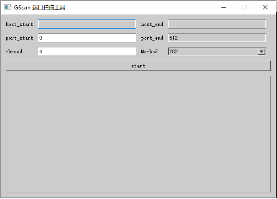

# python端口扫描

---
[TOC]

## 原理
端口扫描可以用socket尝试连接相应的端口，能连接上即该端口开放着。
需要注意的一点是，因为有的端口关闭的时候，连接时会等待很长时间，所以可以设置timeout，连接超时的时间，如果超过了一定的时间即自动放弃，认为该端口关闭。

## 版本

**Version 0.1**
```python
import socket  
def scan(port):  
    s = socket.socket()
    s.settimeout(0.1)  
    if s.connect_ex(('localhost', port)) == 0:  
        print port, 'open'  
    s.close()  
if __name__ == '__main__':  
    map(scan,range(1,65536)) 
```

**Version 0.2**
- 加入了自定义扫描的IP
- 加入了自定义的起始与结束端口

```python
import socket  
import sys

def scan(port):  
    s = socket.socket()  
    s.settimeout(0.1)
    if s.connect_ex((sys.argv[1], port)) == 0:  
        print port, 'open'  
    s.close()  
if __name__ == '__main__':  
	start = int(sys.argv[2])
	end   = int(sys.argv[3])
	map(scan,range(start,end))  
```

**Version 0.3**
- 设置了默认的扫描IP：127.0.0.1
- 设置了默认的扫描端口：0 - 512
- 当然，还是能够自定义扫描IP和端口
- 让端口关闭的也打印出来

```python
import argparse
import socket  
import sys

def scan(host,port):  
	s = socket.socket()  
	s.settimeout(0.1)
	if s.connect_ex((host, port)) == 0:  
		print port, 'open'  
	else:
		print port ,'Close'
	s.close()  
	
if __name__ == '__main__':  
	parser = argparse.ArgumentParser(description="input your host and port")
	parser.add_argument("--host",help="chose host",action="store",default='127.0.0.1',dest="host")
	parser.add_argument("--start",help="chose port start",action="store",type=int,default=0,dest="start")
	parser.add_argument("--end",help="chose port end",action="store",type=int,default=512,dest="end")
	args = parser.parse_args()
	host = args.host
	start = args.start
	end   = args.end
	for item in range(start,end):
		scan(host,item)
```

**Version 1.0**
- 参数1 ： '-o' 或者 '--on' 选择是否显示关闭的端口，默认关闭
- 参数2 ： '--host' 选择将要扫描的IP，默认为127.0.0.1
- 参数3 ： '--start' 选择将要扫描的IP开始端口，默认为0
- 参数4 ： '--end' 选择将要扫描的IP结束端口，默认为512

```python
import argparse
import socket  
import sys

def scan(host,port,show):  
	s = socket.socket()  
	s.settimeout(0.1)
	if s.connect_ex((host, port)) == 0:  
		print port, 'open'  
	else:
		if show:
			print port ,'Close'
	s.close()  
if __name__ == '__main__':  
	parser = argparse.ArgumentParser(description="input your host and port")
	parser.add_argument("-o","--on",help="show close",action="store_true")
	parser.add_argument("--host",help="chose host",action="store",default='127.0.0.1',dest="host")
	parser.add_argument("--start",help="chose port start",action="store",type=int,default=0,dest="start")
	parser.add_argument("--end",help="chose port end",action="store",type=int,default=513,dest="end")
	args = parser.parse_args()
	host = args.host
	start = args.start
	end   = args.end
	show = args.on
	for item in range(start,end):
		scan(host,item,show)
```

**Version 1.1**
增加了一些新的参数，而且可以查看相关端口服务。  
- 参数1 ： '-o' 或者 '--on' 选择是否显示关闭的端口，默认关闭
- 参数2 ： '--host' 选择将要扫描的IP，默认为127.0.0.1
- 参数3 ： '--host_start' 选择将要扫描的IP的起始IP，默认为127.0.0.1
- 参数4 ： '--host_end' 选择将要扫描的IP的终止IP，默认为127.0.0.1
- 参数5 ： '--port' 选择将要扫描的IP的端口，默认为80
- 参数6 ： '--port_start' 选择将要扫描的IP开始端口，默认为0
- 参数7 ： '--port_end' 选择将要扫描的IP结束端口，默认为512

```python
import argparse
import socket  
import sys

def scan(host,port,show):  
	s = socket.socket()  
	protocolname = 'tcp'
	s.settimeout(0.1)
	if s.connect_ex((host, port)) == 0:  
		try:
			print "%s  open => service name: %s" %(port,socket.getservbyport(port,protocolname))
		except:
			print port, 'open => service name: No Found'  
	else:
		if show:
			print port ,'Close'
	s.close()  
if __name__ == '__main__':  
	parser = argparse.ArgumentParser(description="input your host and port")
	parser.add_argument("-o","--on",help="show close",action="store_true")
	parser.add_argument("--host",help="chose host",action="store",default='127.0.0.1',dest="host")
	parser.add_argument("--host_start",help="chose host_start",action="store",default='127.0.0.1',dest="host_start")
	parser.add_argument("--host_end",help="chose host_end",action="store",default='127.0.0.1',dest="host_end")
	parser.add_argument("--port",help="chose port",action="store",default=80,type=int,dest="port")
	parser.add_argument("--port_start",help="chose port port_start",action="store",type=int,default=0,dest="port_start")
	parser.add_argument("--port_end",help="chose port port_end",action="store",type=int,default=512,dest="port_end")
	args = parser.parse_args()
	host = args.host
	host_start = args.host_start
	host_end   = args.host_end
	port = args.port
	port_start = args.port_start
	port_end   = args.port_end
	show = args.on
	if host == "127.0.0.1":
		for hosts in range(int(host_start.split(".")[-1]),int(host_end.split(".")[-1])+1):
			hosts = host_start.split(".")[0]+"."+host_start.split(".")[1]+"."+host_start.split(".")[2]+"."+str(hosts)
			print "----------"+hosts+"----------"
			if host_start != host_end and port_start == 0 and port_end == 512:
				scan(hosts,port,show)
			elif host_start != host_end and port_start != 0 or port_end != 512:
				for ports in range(port_start,port_end+1):
					scan(hosts,ports,show)
			elif host_start == host_end and port == 80:
				for ports in range(port_start,port_end+1):
					scan(hosts,ports,show)
			elif host_start == host_end and port != 80:
				scan(hosts,port,show)
			else:
				print "En... Your Input Is Wrong"
	else:
		print "----------"+host+"----------"
		if port_start == 0 and port_end == 512:
			scan(host,port,show)
		else:
			for ports in range(port_start,port_end):
				scan(host,ports,show)

```

*示例*
```shell
#显示关闭的端口，扫描127.0.0.1的从0到512的端口
python scan_1_1.py -o 
#扫描192.168.0.1到192.168.0.100的80端口
python scan_1_1.py --host_start=192.168.0.1 --host_end=192.168.0.100
#扫描192.168.0.1的22端口
python scan_1_1.py --host=192.168.0.1 --port=22
```

**Version 1.2**                                
加入了多线程，使端口扫描速度得到了大幅度的提高。                     

```python
#coding=utf-8

import threading
from Queue import Queue
from time import ctime
import socket  
import sys

def scan(port):  
	s = socket.socket()  
	s.settimeout(0.1)
	if s.connect_ex((sys.argv[1], port)) == 0:  
		print port, 'open'  
	s.close()  

def writeQ(queue,start,end):
	for i in range(start,end):
		queue.put(i,1)

def readQ(queue,start,end):
	for i in range((end-start)/2):
		num = queue.get(1)
		scan(num)

print "all start at: ",ctime()

start = int(sys.argv[2])
end   = int(sys.argv[3])

funcs = [writeQ,readQ]
nfunc = range(len(funcs))

q = Queue(65535)
threads = []

t = threading.Thread(target=funcs[0],args=(q,start,end))
threads.append(t)	

for i in range(2):
	t = threading.Thread(target=funcs[1],args=(q,start,end))
	threads.append(t)	

for i in range(3):
	threads[i].start()

for i in range(3):
	threads[i].join()

print "all end   at: ",ctime()	
```

**Version 2.0**                                                          
完善了多线程，可以自己选择开启多少个线程。                                               
- 参数8 ： '--thread' 选择将要启动多少个线程，默认为4                               

```python
#coding=utf-8

import threading
import argparse
from Queue import Queue
import socket  
import sys

def scan(host,port,show):  
	s = socket.socket()  
	protocolname = 'tcp'
	s.settimeout(0.1)
	if s.connect_ex((host, port)) == 0:  
		try:
			print "%s  open => service name: %s" %(port,socket.getservbyport(port,protocolname))
		except:
			print port, 'open => service name: No Found'  
	else:
		if show:
			print port ,'Close'
	s.close()  

def writeQ(queue,start,end):
	for i in range(start,end):
		queue.put(i,1)

def readQ(queue,host,start,end,show,thread):
	for i in range((end-start)/thread):
		num = queue.get(1)
		scan(host,num,show)

def thread_demo(host,port_start,port_end,show,thread):
	funcs = [writeQ,readQ]
	nfunc = range(len(funcs))
	q = Queue(65535)
	threads = []
	t = threading.Thread(target=funcs[0],args=(q,port_start,port_end))
	threads.append(t)	
	for i in range(thread):
		t = threading.Thread(target=funcs[1],args=(q,host,port_start,port_end,show,thread))
		threads.append(t)	
	for i in range(thread+1):
		threads[i].start()
	for i in range(thread+1):
		threads[i].join()

if __name__ == '__main__':  
	parser = argparse.ArgumentParser(description="input your host and port")
	parser.add_argument("-o","--on",help="show close",action="store_true")
	parser.add_argument("--host",help="chose host",action="store",default='127.0.0.1',dest="host")
	parser.add_argument("--host_start",help="chose host_start",action="store",default='127.0.0.1',dest="host_start")
	parser.add_argument("--host_end",help="chose host_end",action="store",default='127.0.0.1',dest="host_end")
	parser.add_argument("--port",help="chose port",action="store",default=80,type=int,dest="port")
	parser.add_argument("--port_start",help="chose port port_start",action="store",type=int,default=0,dest="port_start")
	parser.add_argument("--port_end",help="chose port port_end",action="store",type=int,default=512,dest="port_end")
	parser.add_argument("--thread",help="how much thread",action="store",type=int,default=4,dest="thread")
	args = parser.parse_args()
	host = args.host
	host_start = args.host_start
	host_end   = args.host_end
	port = args.port
	port_start = args.port_start
	port_end   = args.port_end
	thread = args.thread
	show = args.on
	if host == "127.0.0.1":
		for hosts in range(int(host_start.split(".")[-1]),int(host_end.split(".")[-1])+1):
			hosts = host_start.split(".")[0]+"."+host_start.split(".")[1]+"."+host_start.split(".")[2]+"."+str(hosts)
			print "----------"+hosts+"----------"
			if host_start != host_end and port_start == 0 and port_end == 512:
				scan(hosts,port,show)
			elif host_start != host_end and port_start != 0 or port_end != 512:
				thread_demo(hosts,port_start,port_end+1,show,thread)
			elif host_start == host_end and port == 80:
				thread_demo(hosts,port_start,port_end+1,show,thread)
			elif host_start == host_end and port != 80:
				scan(hosts,port,show)
			else:
				print "En... Your Input Is Wrong"
	else:
		print "----------"+host+"----------"
		if port != 80:
			scan(host,port,show)
		else:
			thread_demo(host,port_start,port_end+1,show,thread)

				
```

**Version 3.0**                                                          

添加了对 UDP 端口扫描的支持

- 参数9 ： '-u','--udp' 选择扫描 UDP 端口

```
#coding=utf-8

import threading
import argparse
from Queue import Queue
import socket  
import sys

def scan(host, port, show):  
	s = socket.socket()  
	protocolname = 'tcp'
	s.settimeout(0.1)
	if s.connect_ex((host, port)) == 0:  
		try:
			print "%4d open => service name: %s" %(port,socket.getservbyport(port,protocolname))
		except:
			print '%4d open => service name: No Found'%port
	elif show:
			print port ,'Close'
	s.close()  

def udp_scan(host, port, show):
    udpsock = socket.socket(socket.AF_INET, socket.SOCK_DGRAM)
    udpsock.settimeout(0.6)
    freq = 0
    for j in xrange(3):
        udpsock.sendto("", (host, port))
        try:
            data, addr = udpsock.recvfrom(1024)
        except socket.timeout:
            freq += 1
        except Exception,e:
            if e.errno == 10054:
                pass
            else:
                print e,e.errno
    if freq == 3:
        try:
            print "%4d open => udp service name: %s"%(port, socket.getservbyport(port, 'udp'))
        except:
            print "%4d open => udp service name: %s"%(port, "No Found")
    elif show:
    	print port ,'Close'
    udpsock.close()

def writeQ(queue,start,end):
	for i in range(start, end+1):
		queue.put(i)

def readQ(queue, host, start, end, show, thread, udp):
	for i in range((end-start)/thread + 1):
		try:
			num = queue.get(block=False)
			if udp:
				udp_scan(host, num, show)
			else:
				scan(host, num, show)
		except:
			pass

def thread_demo(host, port_start, port_end, show, thread, udp):
	funcs = [writeQ,readQ]
	nfunc = range(len(funcs))
	q = Queue(65535)
	threads = []
	t = threading.Thread(target=funcs[0],args=(q,port_start,port_end))
	threads.append(t)
	for i in range(thread):
		t = threading.Thread(target=funcs[1],args=(q, host, port_start, port_end, show, thread, udp))
		threads.append(t)
	for i in range(thread+1):
		threads[i].start()
	for i in range(thread+1):
		threads[i].join()

if __name__ == '__main__':  
	parser = argparse.ArgumentParser(description="input your host and port")
	parser.add_argument("-o","--on",help="show close",action="store_true")
	parser.add_argument("-u","--udp",help="UDP scan",action="store_true")
	parser.add_argument("--host",help="chose host",action="store",default='127.0.0.1',dest="host")
	parser.add_argument("--host_start",help="chose host_start",action="store",default='127.0.0.1',dest="host_start")
	parser.add_argument("--host_end",help="chose host_end",action="store",default='127.0.0.1',dest="host_end")
	parser.add_argument("--port",help="chose port",action="store",default=80,type=int,dest="port")
	parser.add_argument("--port_start",help="chose port port_start",action="store",type=int,default=0,dest="port_start")
	parser.add_argument("--port_end",help="chose port port_end",action="store",type=int,default=512,dest="port_end")
	parser.add_argument("--thread",help="how much thread",action="store",type=int,default=4,dest="thread")
	args = parser.parse_args()
	host = args.host
	host_start = args.host_start
	host_end   = args.host_end
	port = args.port
	port_start = args.port_start
	port_end   = args.port_end
	thread = args.thread
	show = args.on
	udp = args.udp
	if host == "127.0.0.1":
		for hosts in range(int(host_start.split(".")[-1]),int(host_end.split(".")[-1])+1):
			hosts = host_start.split(".")[0]+"."+host_start.split(".")[1]+"."+host_start.split(".")[2]+"."+str(hosts)
			print "---------- "+hosts+" ----------"
			if host_start != host_end and port_start == 0 and port_end == 512:
				scan(hosts, port, show, udp)
			elif host_start != host_end and port_start != 0 or port_end != 512:
				thread_demo(hosts, port_start, port_end, show, thread, udp)
			elif host_start == host_end and port == 80:
				thread_demo(hosts, port_start, port_end, show, thread, udp)
			elif host_start == host_end and port != 80:
				scan(hosts, port, show, udp)
			else:
				print "En... Your Input Is Wrong"
	else:
		print "----------"+host+"----------"
		if port != 80:
			scan(host, port, show, udp)
		else:
			thread_demo(host, port_start, port_end, show, thread, udp)

```

## GUI 版本 GScan



## TODO

1. nmap其他功能

nmap 的使用功能

- `-A` 详细参数，包括所有开放端口，端口提供服务，操作系统类型等。
- `--open` 只显示开放端口
- ` --system-dns` 使用系统的 DNS 服务器
- `--dns-servers` 自行设定 DNS 服务器
- `-oN|oX <filename>` 以正常格式 normal|XML 格式输出到文件
- `--spoof-mac <mac address>` 伪装你的 Mac 地址
- `-sU` UDP 端口扫描
- `-sn|sP` Ping 测试 ，可以 `nmap -sn 10.177.233.31/24` ，可以 `nmap -sn 10.177.233.1-255`
- `-sT` TCP 连接扫描，会在目标主机中有请求记录
- `-sS` TCP SYN 扫描，只进行TCP三次握手的前两步，很少有系统计入日志，默认使用，需要root权限
- `-sF` TCP FIN 模式探查，不被目标主机计入日志
- `-sX` 圣诞树(Xmas Tree) 模式探查
- `-p <range>` 指定端口扫描 `-p22; -p1-65535; -p U:53,111,137,T:21-25,80,139,8080,S:9` 若不指定端口则扫描65535个端口，默认只扫1000个危险端口
- `-F`  使用快速扫描模式 Fast mode 进行扫描
- `-sV` 扫描端口时同时探测服务版本号等信息
- `-O` 进行操作系统类型探查
- `-S <IP_Address>` 伪造 IP地址进行扫描
- `-e <iface>` 使用指定的网卡进行扫描
- `--traceroute` 显示探查中经过的节点
- `-v` 显示扫描过程
- `-vv` 显示详细扫描过程

## 参考链接

[飘逸的python - 写个端口扫描器及各种并发尝试(多线程/多进程/gevent/futures)](http://blog.csdn.net/handsomekang/article/details/39826729)
